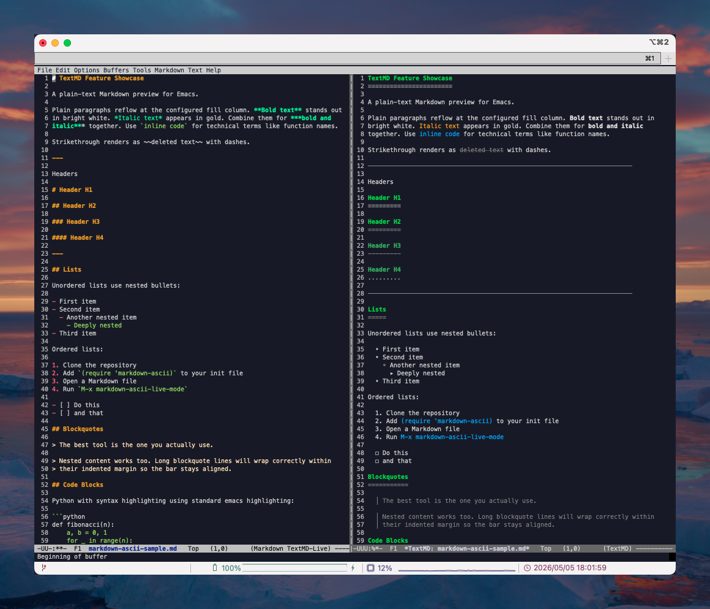
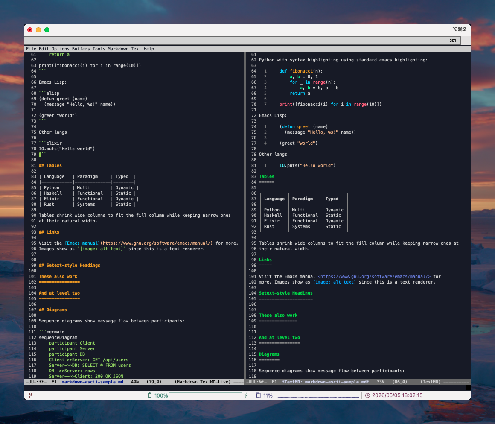
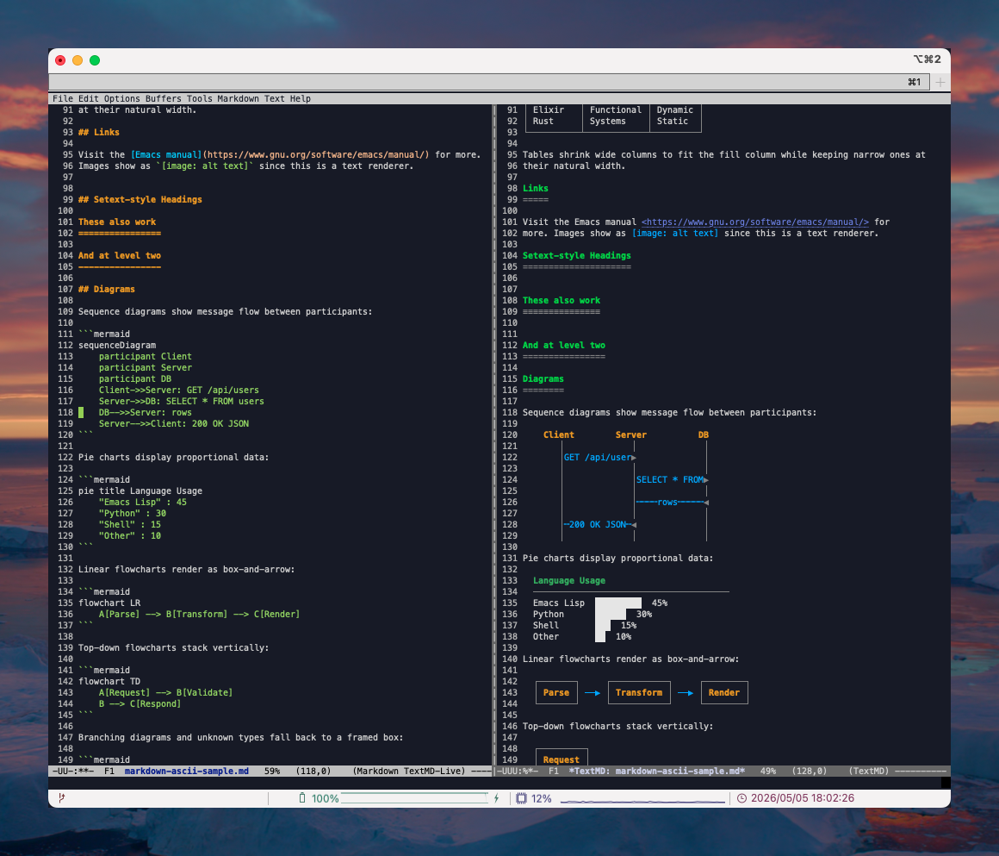
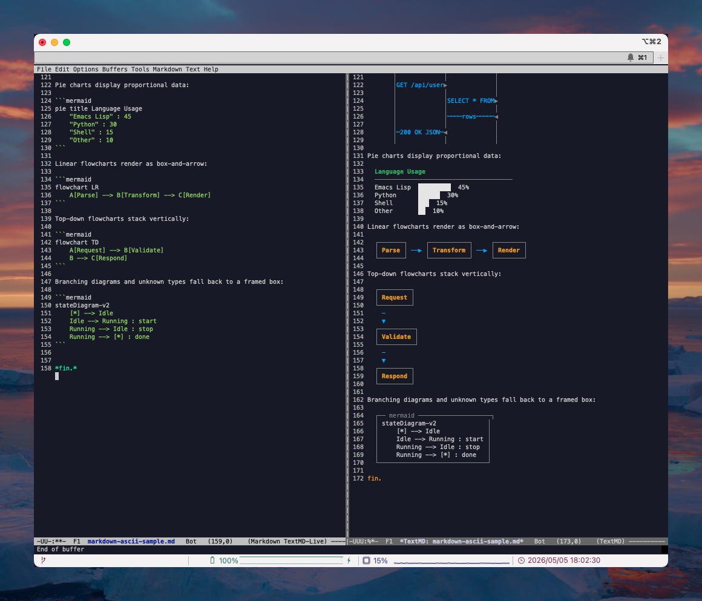

# Ascii Markdown preview for Emacs

Renders Markdown as formatted text with ANSI faces. No HTML, no browser, no external tools, a few dependencies like font-lont.

- Headings, bold, italic, strikethrough, inline code
- Fenced code blocks with syntax highlighting (via Emacs font-lock)
- Tables, blockquotes, ordered and unordered lists, checkboxes
- Horizontal rules, links, setext-style headings
- Mermaid diagrams rendered as ASCII art (sequence, pie, flowchart; others fall back to a framed box)
- Live updates

This is a LLM generated do-over of a halfbaked covid-lockdown version. It's completely rewritten and more feature cmplete.

## Installation

### Emacs 29+ (built-in `package-vc-install`)

```elisp
(package-vc-install "https://github.com/eskil/markdown-ascii")
```

### straight.el

```elisp
(straight-use-package
 '(markdown-ascii :type git :host github :repo "eskil/markdown-ascii"))
```

### elpaca

```elisp
(elpaca (markdown-ascii :host github :repo "eskil/markdown-ascii"))
```

### Manual

```
git clone https://github.com/eskil/markdown-ascii ~/.emacs.d/markdown-ascii
```

```elisp
(add-to-list 'load-path "~/.emacs.d/markdown-ascii")
(require 'markdown-ascii)
```

## Usage

| Command | Description |
|---|---|
| `M-x markdown-ascii-preview` | Render current buffer in a side window |
| `M-x markdown-ascii-live-mode` | Auto-refresh preview on save |

In the preview buffer: `q` to quit, `g` to refresh manually.

## iterm2

Enable italic text under `Profiles -> Text -> Allow italic text`.

## Configuration

```elisp
(setq markdown-ascii-fill-column 80)   ; paragraph wrap width (0 = no wrap)
(setq markdown-ascii-width 72)         ; horizontal rule width
```

## Sample

Open `markdown-ascii-sample.md` (included in the repo) and run `M-x markdown-ascii-preview` to see all supported features.

## Screenshots

### v1.0.0





