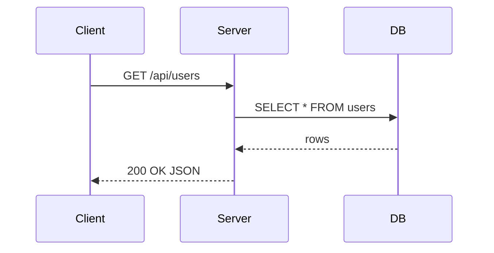
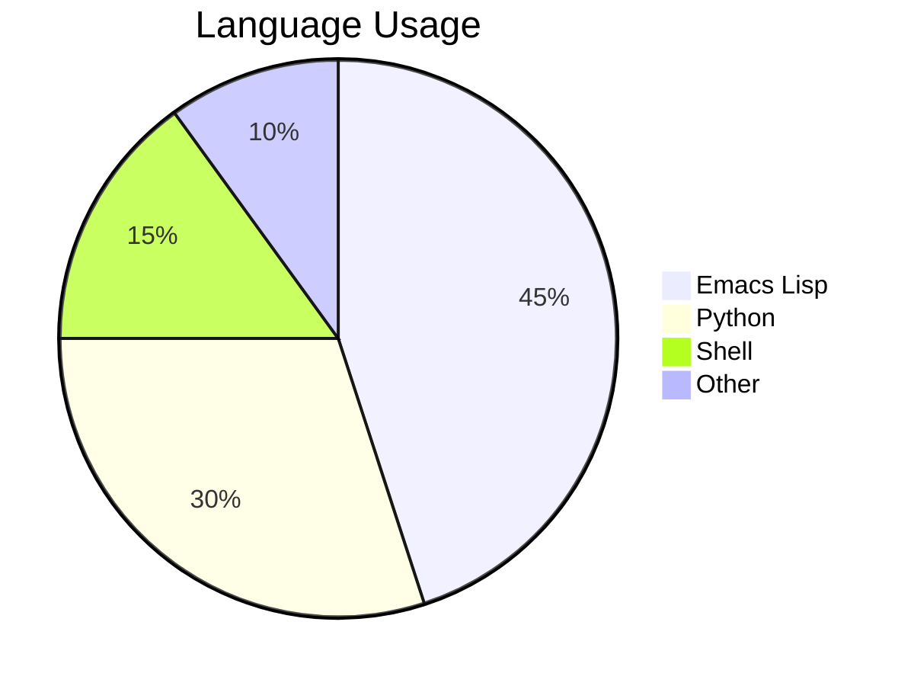
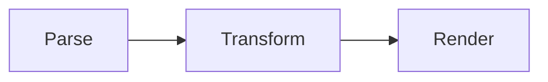
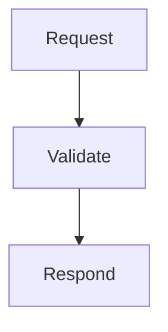
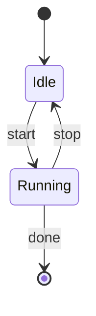

# TextMD Feature Showcase

A plain-text Markdown preview for Emacs. 

Plain paragraphs reflow at the configured fill column. **Bold text** stands out
in bright white. *Italic text* appears in gold. Combine them for ***bold and
italic*** together. Use `inline code` for technical terms like function names.

Strikethrough renders as ~~deleted text~~ with dashes.

---

Headers

# Header H1

## Header H2

### Header H3

#### Header H4

---

## Lists

Unordered lists use nested bullets:

- First item
- Second item
  - Another nested item
    - Deeply nested
- Third item

Ordered lists:

1. Clone the repository
2. Add `(require 'markdown-ascii)` to your init file
3. Open a Markdown file
4. Run `M-x markdown-ascii-live-mode`

- [ ] Do this
- [ ] and that

## Blockquotes

> The best tool is the one you actually use.

> Nested content works too. Long blockquote lines will wrap correctly within
> their indented margin so the bar stays aligned.

## Code Blocks

Python with syntax highlighting using standard emacs highlighting:

```python
def fibonacci(n):
    a, b = 0, 1
    for _ in range(n):
        a, b = b, a + b
    return a

print([fibonacci(i) for i in range(10)])
```

Emacs Lisp:

```elisp
(defun greet (name)
  (message "Hello, %s!" name))

(greet "world")
```

Other langs

```elixir
IO.puts("Hello world")
```

## Tables

| Language   | Paradigm     | Typed  |
|------------|--------------|--------|
| Python     | Multi        | Dynamic |
| Haskell    | Functional   | Static |
| Elixir     | Functional   | Dynamic |
| Rust       | Systems      | Static |

Tables shrink wide columns to fit the fill column while keeping narrow ones
at their natural width.

## Links

Visit the [Emacs manual](http://www.gnu.org/software/emacs/manual/) for more.
Images show as `[image: alt text]` since this is a text renderer.


## Setext-style Headings

These also work
================

And at level two
----------------

## Diagrams

Sequence diagrams show message flow between participants:



Pie charts display proportional data:



Linear flowcharts render as box-and-arrow:



Top-down flowcharts stack vertically:



Branching diagrams and unknown types fall back to a framed box:



_fin._
